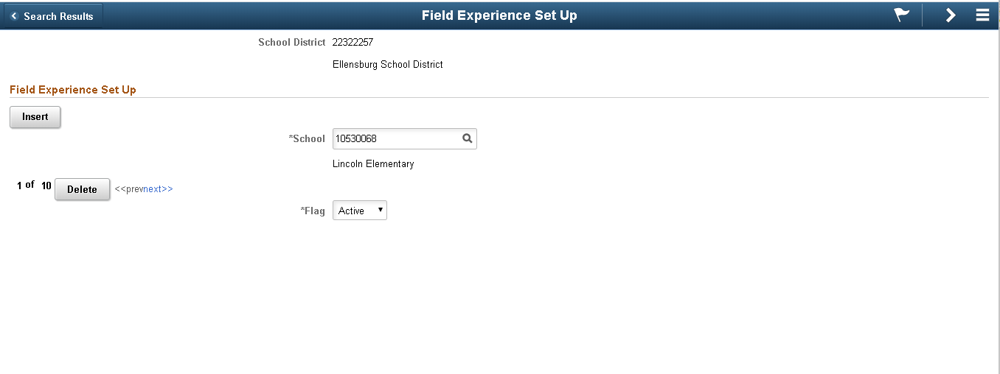

# Introduction
Developing scroll areas in fluid can be surprising. In classic, several row action buttons are provided by default. These include row insert, row delete, top, previous, row counter, next, bottom, find and view all. In contrast, fluid scroll areas only include row insert and row delete by default. According to a paper published by Oracle, scroll buttons are not yet supported in fluid scroll areas (Doc ID 1984833.1). Many users rely on this functionality and would find the page to be less useful without it.

This article discusses the development of some of these row action buttons/links and is meant to serve as a quick-start guide or reference. 

# Classic Example
Figure 1 shows a setup page for CWU's field experience log. The purpose is to associate schools with school districts. Scroll level 0 shows the school district and the scroll area at level 1 shows the related schools. As you can see, this page is implemeted in the classic paradigm. 

<p align="center">
</br>
Figure 1: Classic page with scroll area.
</p>

The hightlighted row action buttons are provided by default. As demonstrated in Figure 2, the same is not true when converting to the fluid user interface design. 

These row action buttons are defined below.
- **Previous:** Controls how a user can move to a previous row in the scroll area.
- **Row Counter:** Tracks the number of rows in the scroll area and in which row the cursor focuses. Text is the default setting, and, for example, 1-6 of 6 appears in the navigation bar if the scroll area has six rows.  
- **Next:** Controls how a user can move to the next row in the scroll area.
- **View All:** Enables the user to view all rows of data at once.
- **Insert/Delete:** Select to display Insert and Delete buttons on each scroll area row at runtime. The action buttons can appear on the left or right side of the scroll area. Click the properties button to open the Body Area Row Action Button Properties dialog box. 

# Fluid Conversion
In order to demonstrate fluid scroll area development, the previous classic page example was converted to fluid. Classic to fluid conversion is out of scope for this article, but the general steps are as follows:

1. Create the fluid component
2. Create the fluid page and add it to the fluid component
3. Update all PeopleCode references
4. Update or delete unsupported controls
5. Enable search page (more information [here](http://peoplesoftfluidui.blogspot.com/2018/03/search-in-fluid-pages.html))
6. Adjust and finalize layout
7. Implement responsive and adaptive behaviors

Detailed information for converting classic pages to fluid can be found in [this](https://docs.oracle.com/cd/E92520_02/psft/pdf/pt856tflu-b102018.pdf) guide.

Our new fluid page is shown in Figure 2 after completing steps 1, 2, 3, and 5.

<p align="center">
</br>
Figure 2: Fluid page after conversion from classic.
</p>

As you can see, the scroll area doesn't appear how you would expect. The row actions buttons will need to be implemented by a developer.

## Implementing Fluid Scroll Area Controls
As is the case with most tasks, there are many ways to provide scroll navigation in fluid. Several methods will be discussed, but additional (and possibly better) methods do exist.

### Row Insert
Row insert is one of two scroll action buttons provided by default. The easiest way to implement this action is to leave it as-is.

A custom row insert button/link can be used instead. This may be a good option for those who want more control over the button. If this is the chosen method, the first step is to hide the existing row insert button. This can be accomplished by deselecting the 'Display Row Action Buttons' checkbox in the scroll area properties label tab (see Figure 3).

<p align="center">
</br>
Figure 3: Scroll Area Properties: unchecking Display Row Action Properties.
</p>

<p align="center">
</br>
Figure 4: Page after hiding the default insert and delete buttons.
</p>

After the default buttons are removed, add a Push Button/Hyperlink page control to page. 

<p align="center">
</br>
Figure 5: Adding an insert button to the page in app designer.
</p>

<p align="center">
</br>
Figure 6: Page after adding a new insert button.
</p>

Once a custom insert button exists, use one of the two methods described in the following sections to use the button. 

#### Scroll Action Properties
This method is easier to implement than the PeopleCode one. In the Push Button/Hyperlink Properties type tab, set the Destination to 'Scroll Action', the Action Type to 'Row Insert', and the Related Control to the desired scroll area. 

***\*Scroll Level should be same as scroll area***

<p align="center">
</br>
Figure 7: Scroll Area Properties: setting scroll area type to Scroll Action.
</p>

#### PeopleCode
This method is more difficult to implement, but is much more flexible. The first step is to define the Push Button/Hyperlink Properties type tab. Set the Destination to 'PeopleCode Command' and associate the push button record and field names. 

***\*Scroll Level should be outside scroll area level***

<p align="center">
</br>
Figure 8: Scroll Area Properties: setting scroll area type to PeopleCode Command.
</p>

Now, the PeopleCode to insert the row must be created. This code can be triggered by the Record Field Change event or the Component Record Field Change event. 

**Example code:**</br>
```Local Rowset &rs = GetLevel0()(1).GetRowset(Scroll.CW_SCHOOL_STP);```</br>
```&rs.InsertRow(&rs.ActiveRowCount);```

### Row Delete
Row delete is also provided by default. To hide the default insert and delete buttons, uncheck the 'Display Row Action Buttons' checkbox in the scroll area properties label tab (see Figures 3 and 4).

A custom row delete button can be created similarily to the row insert button. First, add the control to the page. 

<p align="center">
</br>
Figure 9: Adding a delete button to the page in app designer.
</p>

<p align="center">
</br>
Figure 10: Page after adding a new insert button.
</p>

After that, make it functional according to one of the following sections.

#### Scroll Action Properties
In the Push Button/Hyperlink Properties type tab, set the Destination to 'Scroll Action', the Action Type to 'Row Delete', and the Related Control to the desired scroll area. 

***\*Scroll Level should be same as scroll area***

<p align="center">
</br>
Figure 11: Scroll Area Properties: setting scroll area type to Scroll Action.
</p>

#### PeopleCode
In the Push Button/Hyperlink Properties type tab, set the Destination to 'PeopleCode Command' and associate the push button record and field names. 

***\*Scroll Level should be outside scroll area level***

<p align="center">
</br>
Figure 12: Scroll Area Properties: setting scroll area type to PeopleCode Command.
</p>

Now, the PeopleCode to delete the row must be created. This code can be triggered by the Record Field Change event or the Component Record Field Change event. 

**Example code:**</br>
```Local Rowset &rs = GetLevel0()(1).GetRowset(Scroll.CW_SCHOOL_STP);```</br>
```&rs.DeleteRow(CurrentRowNumber());```

### Previous
First, add a new button/hyperlink to your page.

<p align="center">
</br>
Figure 13: Adding a previous link to the page in app designer.
</p>

In the Push Button/Hyperlink Properties type tab, set the Destination to 'Scroll Action', the Action Type to 'Row Delete', and the Related Control to the desired scroll area.

<p align="center">
</br>
Figure 14: Scroll Area Properties: setting scroll area type.
</p>

<p align="center">
</br>
Figure 15: Page after adding a previous link.
</p>

### Next
First, add a new button/hyperlink to your page.

<p align="center">
</br>
Figure 16: Adding a next link to the page in app designer.
</p>

In the Push Button/Hyperlink Properties type tab, set the Destination to 'Scroll Action', the Action Type to 'Row Delete', and the Related Control to the desired scroll area. 

<p align="center">
</br>
Figure 17: Scroll Area Properties: setting scroll area type.
</p>

<p align="center">
</br>
Figure 18: Page after adding a next link.
</p>

### Row Counter
A row counter is not really a scroll action, but users are still used to seeing them within scroll areas. A simple row counter can be created with the following steps.

1. Add the necessary page controls
    - **Edit Box 1:** CURRENT_ROW field, make display-only
    - **HTML Area:** constant value "of"
    - **Edit Box 2:** TOTAL_ROWS field, make display only

    <p align="center">
    </br>
    Figure 19: Adding row counter controls in app designer.
    </p>

    <p align="center">
    </br>
    Figure 20: Page after adding row counter controls.
    </p>

2. Add Row Init PeopleCode
    - **CURRENT_ROW example code:**</br>
    ```CW_FLD_EX_WRK.CURRENT_ROW.Value = CurrentRowNumber();```

    - **TOTAL_ROWS example code:**</br>
    ```Local Rowset &rs = GetLevel0()(1).GetRowset(Scroll.CW_SCHOOL_STP);```</br>
    ```CW_FLD_EX_WRK.TOTAL_ROWS.Value = &rs.ActiveRowCount;```

    <p align="center">
    </br>
    Figure 21: Page after adding row init PeopleCode.
    </p>

### View All and View 1
These scroll action buttons are slightly more difficult to implement. The steps are given below. 
1. Duplicate the scroll area on the page

    <p align="center">
    </br>
    Figure 22: Duplicating the scroll area in app designer.
    </p>

2. In the second scroll area properties, general tab, Check the 'Unlimited Occurs Count (rows)' checkbox

    <p align="center">
    </br>
    Figure 23: Scroll Area Properties: setting unlimited occurs count.
    </p>

3. Wrap a groupbox around each scroll area

    <p align="center">
    </br>
    Figure 24: Adding scroll area groupboxes to page in app designer.
    </p>

4. Set the groupbox properties for each groupbox
    - **Record tab:** Set the record and field name

        <p align="center">
        </br>
        Figure 25: Group Box Propeties: Record tab.
        </p>

    - **Use tab:** Check the 'Hide all Fields when Group Box Hidden' checkbox

        <p align="center">
        </br>
        Figure 26: Group Box Propeties: Use tab.
        </p>

    - **Fluid tab:** Set the groupbox type to Layout only

        <p align="center">
        </br>
        Figure 27: Group Box Propeties: Fluid tab.
        </p>

5. Add the push buttons/links to the page

    <p align="center">
    </br>
    Figure 28: Adding view links to the page in app designer.
    </p>

6. Set the push button/link properties for each push button/link
    - **Type tab:** Set the destination to PeopleCode Command and set the record and field names

        <p align="center">
        </br>
        Figure 29: Push Button/Hyperlink Propeties: Type tab.
        </p>

7. Add PeopleCode
    - **Page Activate example code:** </br>
    ```/* default to view one */```</br>
    ```CW_FLD_EX_WRK.GROUPBOX5.Visible = False;```

    - **VIEW_ALL Field Change example code:** </br>
    ```CW_FLD_EX_WRK.GROUPBOX4.Visible = False;```</br>
    ```CW_FLD_EX_WRK.GROUPBOX5.Visible = True;```

    - **VIEW_PB (view one) Field Change example code:** </br>
    ```CW_FLD_EX_WRK.GROUPBOX4.Visible = True;```</br>
    ```CW_FLD_EX_WRK.GROUPBOX5.Visible = False;```

View one/view all functionality should be working at this point. 

<p align="center">
</br>
Figure 30: View One Scroll.
</p>

<p align="center">
</br>
Figure 31: View All Scroll.
</p>

## Styling Fluid Scroll Area Controls
Adding these new controls to the scroll will generally not be enough to provide the best experience. You will have to design and organize the page in a practical manner. In addition, form factor display should be heavily considered. Think about how the scroll will display on a mobile device, laptop, and desktop at minimum.

Here is the final page after performing steps 6 and 7 of the classic to fluid conversion instructions. 

<p align="center">
</br>
Figure 32: Final View One Scroll.
</p>

<p align="center">
</br>
Figure 33: Final View All Scroll.
</p>

## Additional Examples
Here are a couple more examples from various projects I have developed at CWU.

<p align="center">
</br>
Figure 34: Admissions Application Scroll Area.
</p>

<p align="center">
</br>
Figure 35: Field Experience Log Scroll Area
</p>
